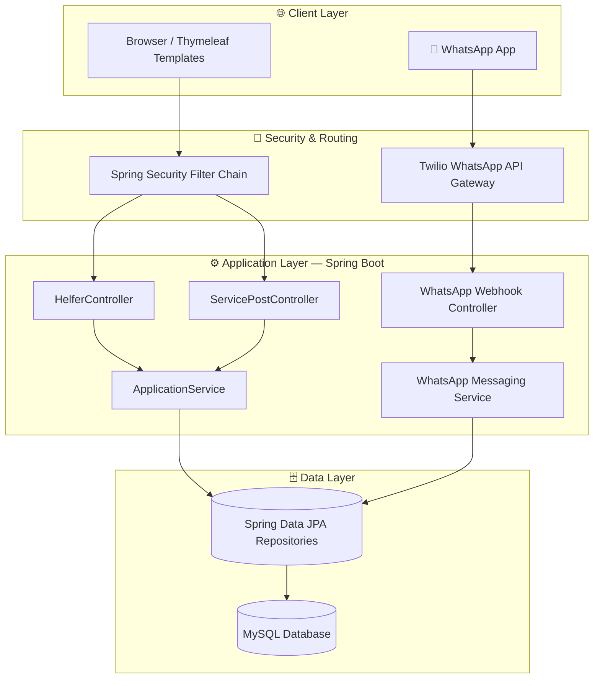
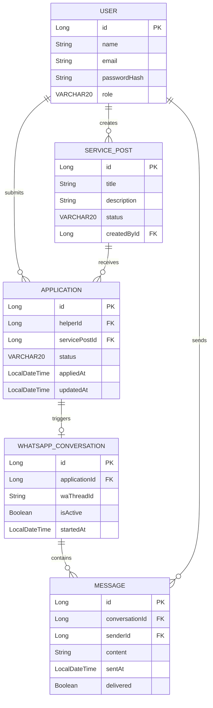
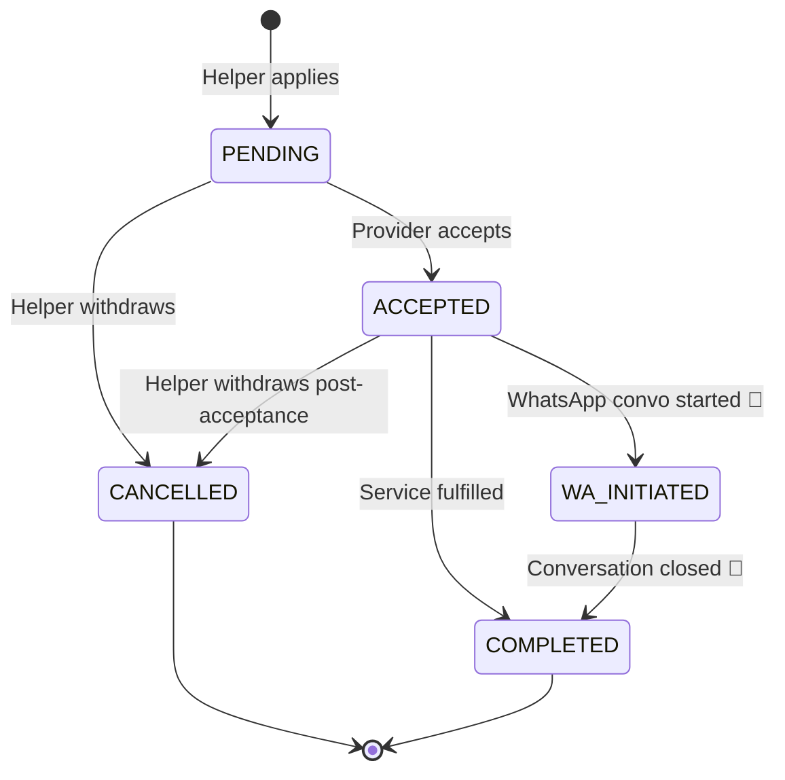
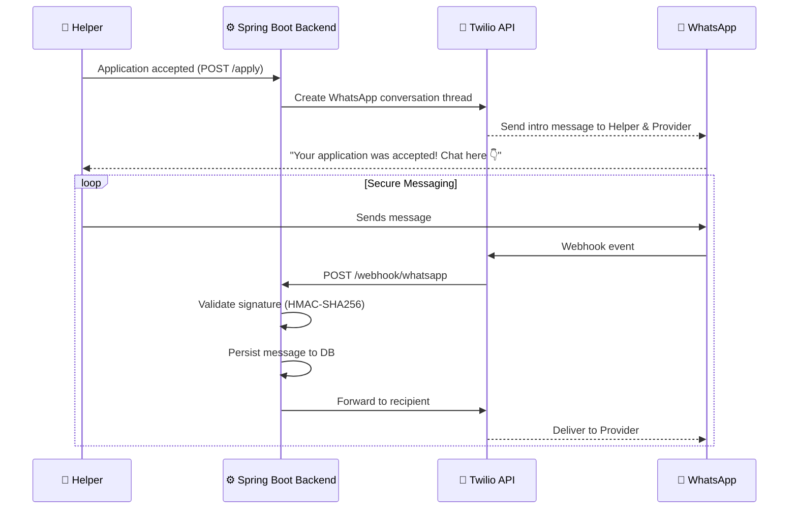
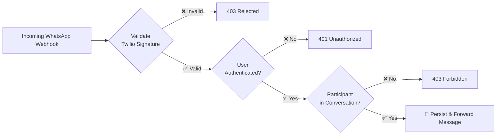

# 🤝 WirHelfen Platform

<div align="center">


**A full-stack service marketplace connecting helpers with people who need them — with real-time WhatsApp messaging on the roadmap.**

[Features](#-features) · [Architecture](#-architecture) · [Database Schema](#-database-schema) · [WhatsApp Integration](#-whatsapp-integration-roadmap) · [Setup](#-setup) · [API](#-api-endpoints)

</div>

---

## 📌 Overview

HelperConnect is a RESTful Spring Boot platform where **service providers** post opportunities and **helpers** discover, apply, and manage their applications — all through a clean, secure web interface. The next milestone: **direct WhatsApp conversations** between helpers and providers, authenticated end-to-end.

---

## ✨ Features

| Feature | Status |
|---|---|
| Helpers can browse & apply to service posts | ✅ Live |
| Application withdrawal (POST-secured) | ✅ Live |
| Application status tracking (PENDING / ACCEPTED / CANCELLED) | ✅ Live |
| Error-resilient DB schema (VARCHAR vs ENUM) | ✅ Live |
| RESTful controllers with full exception handling | ✅ Live |
| WhatsApp direct messaging between users | 🔨 Roadmap |
| End-to-end encrypted conversations | 🔨 Roadmap |
| Real-time notification via WhatsApp webhook | 🔨 Roadmap |

---

## 🏗 Architecture



---

## 🗂 Database Schema



---

## 📊 Application Status Flow



---

## 📱 WhatsApp Integration Roadmap

The goal is to let helpers and service providers chat **directly via WhatsApp** once an application is accepted — without ever leaving their phone.



### Security Model



---

## 🛠 Tech Stack

| Layer | Technology |
|---|---|
| Backend | Java 17, Spring Boot 3, Spring MVC, Spring Security |
| ORM | Hibernate / Spring Data JPA |
| Templates | Thymeleaf |
| Database | MySQL (VARCHAR-based schema — no ENUM restrictions) |
| Messaging (roadmap) | Twilio WhatsApp Business API |
| Deployment | Railway / Docker |

---

## 🚀 Setup

### Prerequisites
- Java 17+
- MySQL 8+
- Maven 3.8+
- (Optional for WhatsApp) Twilio account with WhatsApp Sandbox enabled

### 1. Clone & configure

```bash
git clone https://github.com/your-username/helperconnect.git
cd helperconnect
```

```properties
# application.properties
spring.datasource.url=jdbc:mysql://localhost:3306/helperconnect
spring.datasource.username=root
spring.datasource.password=yourpassword
spring.jpa.hibernate.ddl-auto=update

# Twilio (roadmap)
twilio.account-sid=ACxxxxxxxxxxxxxxxx
twilio.auth-token=your_auth_token
twilio.whatsapp-from=whatsapp:+14155238886
```

### 2. Run

```bash
mvn spring-boot:run
```

App starts at `http://localhost:8080`

---

## 📡 API Endpoints

| Method | Endpoint | Description |
|---|---|---|
| `GET` | `/helfer/applications` | List all applications for logged-in helper |
| `POST` | `/helfer/apply/{servicePostId}` | Submit an application |
| `POST` | `/helfer/applications/{appId}/withdraw` | Withdraw an application |
| `GET` | `/helfer/applications/{appId}/withdraw` | Redirects to service detail (safe fallback) |
| `POST` | `/webhook/whatsapp` | Receive Twilio WhatsApp events *(roadmap)* |

> ⚠️ Withdrawal must always use `POST` — the `GET` fallback exists only to prevent 405 errors on accidental browser navigation.

---

## 🔐 Security Notes

- Withdrawal actions are `POST`-only, protected by Spring Security CSRF tokens
- WhatsApp webhook will validate `X-Twilio-Signature` using HMAC-SHA256 before processing any payload
- All conversation participants are verified before messages are forwarded
- Passwords stored as bcrypt hashes

---

## 📈 Roadmap

- [x] Application lifecycle management
- [x] Error-resilient VARCHAR schema (no ENUM truncation)
- [x] RESTful exception handling & logging
- [ ] WhatsApp conversation on application acceptance
- [ ] End-to-end secure messaging via Twilio
- [ ] Real-time notification webhooks
- [ ] Mobile-first UI redesign
- [ ] Admin dashboard with application analytics

---

## 👤 Author

**Yassine Kalai Ezzar** — Medieninformatik (B.Sc.) @ Berliner Hochschule für Technik  
Full-stack developer · Java / Spring Boot · React · Flutter  
[GitHub](https://github.com/your-username) · [LinkedIn](https://linkedin.com/in/your-profile)

---

<div align="center">
<sub>Built with ☕ Java and a lot of determination.</sub>
</div>
